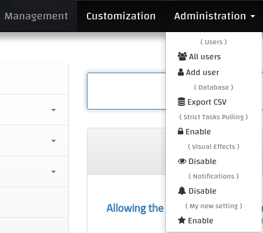

## How do i add additional settings and customizations ?

#### Adding a flag setting
Flag settings are used to enable or disable global features. Available flag settings are usually displayed under the Adminstration dropdown.


Let's go over the steps to add a new flag setting:

1. Adding a new column to the `Setting` model here . Let's name the setting `new_setting` for example.

> The `Setting` model before adding it
```python
class Settings(db.Model, Mixin):
    ...
    visual_effects = db.Column(db.Boolean, nullable=True)

    def __init__(self, notifications=True, strict_pulling=True, visual_effects=True):
        ...
        self.visual_effects = visual_effects
```

> The `Setting` model after adding it
```python
class Settings(db.Model, Mixin):
    ...
    visual_effects = db.Column(db.Boolean, nullable=True)
    new_setting = db.Column(db.Boolean, nullable=True)

    def __init__(self, notifications=True, strict_pulling=True, visual_effects=True,
                 new_setting=False):
        ...
        self.visual_effects = visual_effects
        self.new_setting = new_setting
```

2. Next step is to create a migration file for the database schema change we've just made. for that you'll simply run `./installer.sh --migration migrate`

3. Now within any part of the code, you'll be able to check if `new_setting` is enabled:

```python
from app.database import Settings

Settings.get().new_setting is True  # Enabled
Settings.get().new_setting is False  # Disabled
```

4. Final step is to expose the setting switch to the front-end. You'll add a new list-item `<li>` to the existing list of settings in the base template [here](https://github.com/mrf345/FQM/blob/master/templates/base.html#L106-L150).

> The end of the dropdown before adding `new_setting`
```html
        <li class="dropdown-header">( {{ translate('Notifications', 'en', [defLang]) }} )</li>
        <li>
            <a href="{{ url_for('core.settings', setting='notifications', togo=current_path) }}">
                <span class="fa fa-bell"></span>
                {{ translate('Disable' if settings.notifications == True else 'Enable', 'en', [defLang]) }}
            </a>
        </li>
        
    </ul>
</li>
```

> The end of the dropdown after adding `new_setting`
```html
        <li class="dropdown-header">( {{ translate('Notifications', 'en', [defLang]) }} )</li>
        <li>
            <a href="{{ url_for('core.settings', setting='notifications', togo=current_path) }}">
                <span class="fa fa-bell"></span>
                {{ translate('Disable' if settings.notifications == True else 'Enable', 'en', [defLang]) }}
            </a>
        </li>
        <li class="dropdown-header">( {{ translate('My new setting', 'en', [defLang]) }} )</li>
        <li>
            <a href="{{ url_for('core.settings', setting='new_setting', togo=current_path) }}">
                <span class="fa fa-star"></span>
                {{ translate('Disable' if settings.new_setting == True else 'Enable', 'en', [defLang]) }}
            </a>
        </li>
        
    </ul>
</li>
```

The end result should look like this:


